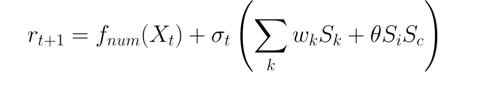

# D’s Method — Volatility-Scaled Sentiment Fusion for Intraday Trading (MFT)

D’s Method is a **research-grade intraday trading system** designed for **medium-frequency trading (MFT)** with a **10-minute prediction horizon**.

The core idea is simple but powerful:

> **Numeric models predict structure.**
> **Sentiment does NOT predict returns directly — it modulates the numeric signal based on volatility and regime.**

This repository contains a **fully working, end-to-end implementation**:

* strict no-leakage design
* volatility-aware fusion
* sentiment decay and confidence handling
* backtesting, live simulation, and dashboard support

---

## 1. Core Equation (D’s Method)

The final return prediction is:



**Interpretation:**

* `f_num(X_t)` → numeric base prediction from price/volume features
* `σ_t` → realized short-horizon volatility
* `S_c, S_m, S_i` → company, market, and index sentiment
* `w_k` → dynamic sentiment weights
* `θ · S_i · S_c` → cross-interaction (alignment vs conflict)

> Sentiment influence automatically **shrinks in low volatility**
> and **amplifies in high volatility** — no hard switches.

---

## 2. High-Level System Pipeline


This diagram shows:

* independent numeric and sentiment pipelines
* late-stage fusion (post-prediction)
* execution after volatility normalization

---

## 3. Data Flow & Verification Loop


Key properties:

* predictions are stored **before** outcomes are known
* realized returns at `t+10` are used only for verification
* financial metrics and ML metrics are tracked separately

---

## 4. Deployment & Cloud Architecture


Designed for:

* **24×7 runtime**
* market-hours-only execution
* auto-restart and health checks
* cloud-friendly deployment (Render / Railway / Cron)

---

## 5. Numeric Model (`f_num`)

### Features (14 total)

* Returns: `ret_1`, `ret_3`, `ret_6`
* Price structure: `hl_range`, `clv`, `ema_gap`
* Dynamics: `ret_accel`
* Volatility: `vol_10`, `vol_30`, `vol_ratio`, `vol_norm`
* Liquidity: `pv`
* Seasonality: `minute_of_day`

### Design rules

* FIFO rolling buffer (40 rows in live mode)
* buffer resets at day boundaries
* no future information allowed

The numeric model is **intentionally simple and stable**
(e.g., Ridge / Linear / Tree-based).

---

## 6. Sentiment System


### Sources

* Company news
* Market / sector news
* Index (NASDAQ / QQQ) news

### Processing

* RSS ingestion
* NLP model (FinBERT or equivalent)
* confidence-weighted scoring
* exponential time decay

Sentiment is **never used raw**.

---

## 7. Execution Logic

### Volatility-normalized signal

```
z_t = r̂_(t+1) / σ_t
```

### Trade rules

* Long if `z_t > entry_threshold`
* Short if `z_t < -entry_threshold`
* Exit using hysteresis (lower exit threshold)

### Risk controls

* **Max 1000 decision points per trading day**
* no cross-day state leakage
* fractional position sizing

---

## 8. Backtesting (Ablation-Safe)

The system supports controlled variants:

| Variant | Description                |
| ------- | -------------------------- |
| V0      | Numeric only               |
| V1      | Numeric + linear sentiment |
| V2      | Numeric + interaction term |
| V3      | Full D’s Method            |

Metrics:

* Directional Accuracy
* Information Coefficient (IC)
* RMSE
* PnL, Sharpe, Drawdown

If sentiment = 0 ⇒ all variants collapse to V0
(**expected and verified behavior**).

---

## 9. Live Operation

* Runs as a **24×7 service**
* Trades only during **market hours (Mon–Fri, 9:30–16:00 NY)**
* Numeric data: `yfinance` (10-min bars)
* Sentiment: RSS feeds
* Default mode: **paper trading**

> This is **MFT**, not HFT.
> Designed for robustness, not microsecond latency.

---

## 10. Project Structure

```
core/        # fusion, volatility, sentiment, rolling buffer
models/      # numeric model (f_num)
backtest/    # V0–V3 backtests
execution/   # execution & hysteresis
live/        # 24×7 live runner
dashboard/   # Streamlit monitoring
docs/        # diagrams & equation images
data/        # local data (git-ignored)
```

---

## 11. Status

✔ End-to-end system complete
✔ No look-ahead bias
✔ Live-ready architecture
✔ Research-grade implementation

---

## 12. Disclaimer

This project is for **research and educational purposes only**.
It is **not financial advice** and is **not intended for live trading with real capital without extensive independent validation**.
